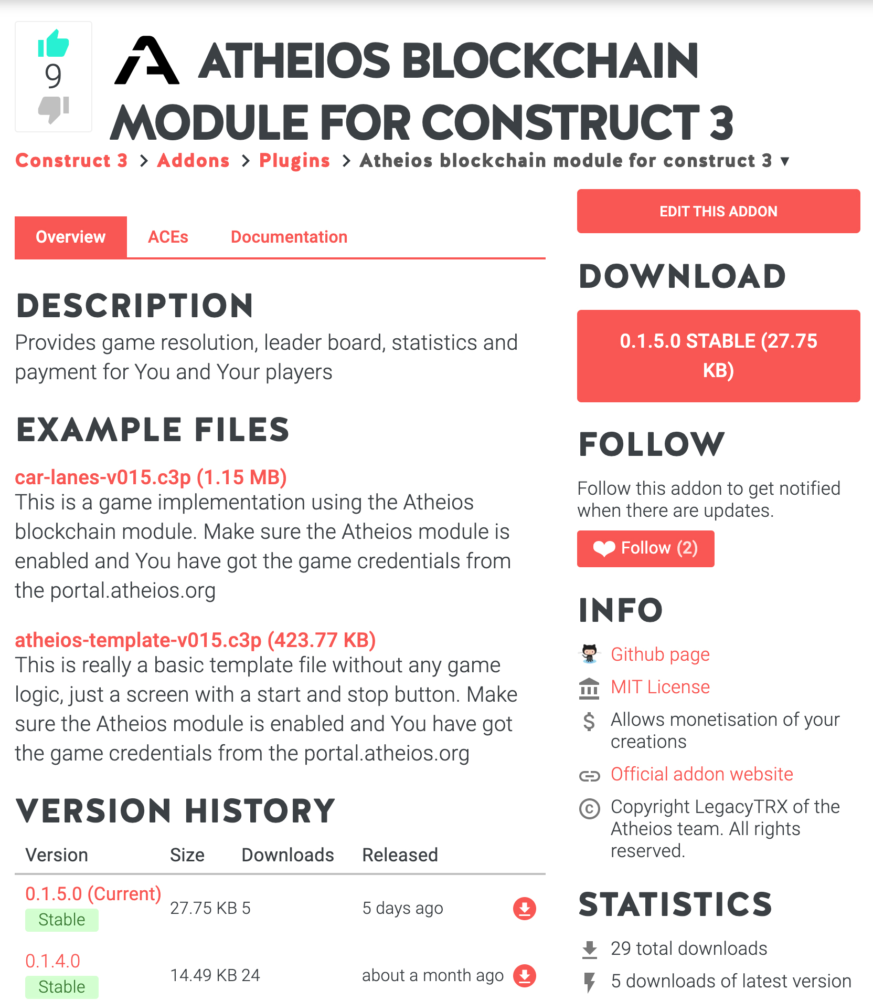
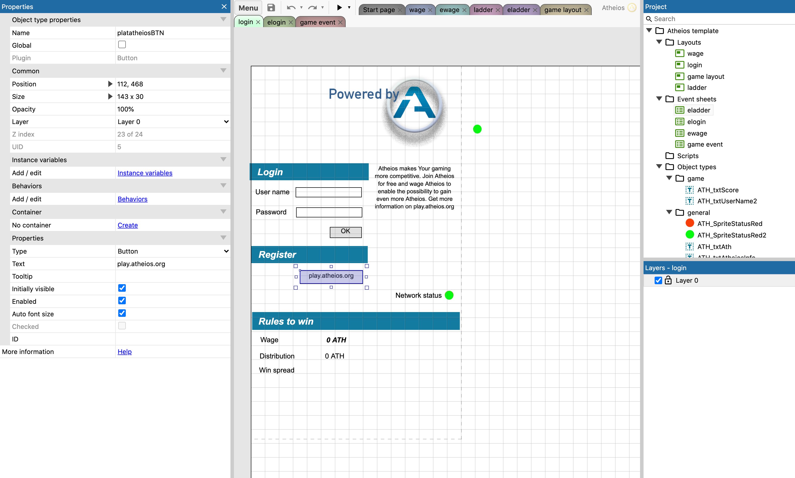

# Construct
Construct is a programmable game engine for HTML5 games and a good entry level into 
gaming. The GARP team has developed a construct 3 modul which can be embedded
into your game project. It provides a possibility to send and receive data via a websocket.

The module can be found here:

[Atheios module](https://www.construct.net/en/make-games/addons/321/atheios-blockchain-module)

  

Download the latest module into the local directory. Open construct 3 and goto
* MENU -> VIEW -> ADDON MANAGER -> Install addon

Select now the local atheios module. Construct3 needs to be restarted. Going back
to the addon manager after the restart You will find the Atheios module in the 
list of activated modules.

On the same module web page You also download a fully integrated game for test 
purposes. However for integration purposes download also the atheios-template-vxxx (xxx 
representing the latest version).

Open that atheios-template-vxxx.c3p file on Construct3. Once the file has loaded You
will see the following layout and event sheets.

  

Check out the different groups
* login - Login layout
* elogin - event functionality for login
* wage
* ewage
* ladder
* eladder
* gamelayout
* gameevent

The last two items are where You need to integrate Your game.
    

On the same page you can also find some example code to show how to communicate 
with the module.

In order for the code to work you need to register as a game developer at:
https://portal.atheios.org or https://portal.ether1.org
After game creation on the portal, you will get a game token an game secret, which you need to use to initialize the Atheios module in construct.

## Configuration
This is the view when clicking on the Atheios module to show the module properties.
There are four properties to schedule:

* apiKey (An alphanumerical string)
* apiSecret (An alphanumerical string)
* local (boolean)
* testapi (boolean)

The first two will be copied from the portal at game registration.
Set local and testapi to false as in the picture.

Setting testapi to true would instead call the testapi, which typically contains the next 
test version of the GARP api.

